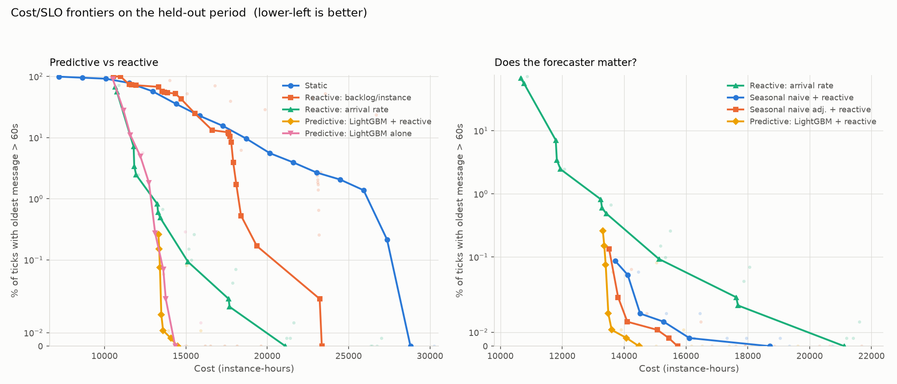

# Predictive Autoscaling for Queue-Backed Workers

Forecast the work that's coming, start the servers before it arrives, and measure
honestly whether that beats just reacting to the queue.

## The idea

Autoscaling on queue depth is always late — the queue only grows once you're
already short of capacity, and then you wait another two to five minutes for
machines to boot while the backlog keeps building. Forecasting the arrival rate
fifteen minutes ahead lets you start those machines early, so they're ready when
the work lands. Most of this repo is the apparatus for checking whether that
actually pays off, and finding where it doesn't.

## Headline result



Any policy can be made cheaper or safer by turning one knob, so a single
measurement describes the tuning, not the policy. Each line is one policy swept
across its own settings. Lower-left is better.

Measured on 12 days of held-out data, never seen during development:

| Target: late messages under | Best reactive | Predictive | |
|---|---|---|---|
| 5% of the time | **11,826** | 13,312 | reactive 11% cheaper |
| 1% | 13,246 | 13,312 | about even |
| 0.1% | 15,128 | **13,405** | predictive 11% cheaper |
| never | 21,120 | **14,482** | predictive 31% cheaper |

*Instance-hours. "Late" = oldest queued message waiting over 60 seconds.*

**The lines cross, and that's the real finding.** If you tolerate occasional
lateness, reacting is cheaper — pre-provisioning for demand that mostly doesn't
need it is wasted money. The stricter the target, the more boot delay dominates,
and the more prediction is worth.

Put another way: at **matched cost**, adding the forecast to an already
well-tuned reactive policy cut late messages from 0.82% to 0.26%.

## How it works

```
  NYC taxi trips ──► arrivals/min ──► split by time, never randomly
  4.7M pickups         60 days          48 days train / 12 held out
                                              │
                        ┌─────────────────────┴──────────────────┐
                        ▼                                        ▼
              forecast arrival rate                   discrete-event simulator
              15 minutes ahead                        queue, workers, boot delay
                        └──────────► scaling policy ◄─────────────┘
                                          │
                                          ▼
                                cost vs. lateness frontier
```

Three choices, because each is a way the result could have been faked:

- **Real traffic, not a sine wave.** Smooth synthetic load makes forecasting
  trivial and the benchmark meaningless. Strip out this trace's daily and weekly
  pattern and what's left is still ~3× burstier than pure randomness.
- **Forecast arrivals, not the queue.** Queue depth and CPU are consequences of
  your own past scaling. Train on those and the model learns to predict itself.
- **Tuned baselines.** Beating a badly configured reactive policy proves nothing.
  Twice during development, tuning the baselines harder changed the answer — both
  times against the predictive policy.

## Forecasting

Predicting arrivals 15 minutes ahead, held-out:

| Model | Avg error (msgs/min) |
|---|---|
| Same time last week | 14.48 |
| Last week, adjusted for today's level | 10.89 |
| **LightGBM** | **7.70** |

No neural network — on tabular time series this size, boosted trees win at a
fraction of the cost. ([predicted vs actual](results/phase4_forecast_vs_actual.png))

## Three things I got wrong

**Forecast accuracy barely mattered.** LightGBM's error is 47% lower than the
one-line "same time last week" baseline. In the scaling loop that bought about
2% in cost — the reactive floor underneath absorbs most forecast error. Build
the naive version and you get most of the benefit.

**Pure prediction is dangerous.** Forecast alone, with nothing watching the
queue, produced a worst case of a message waiting almost 2.5 hours. When the
forecast is wrong and nothing checks, nothing recovers. Ship prediction as a
floor with reactive scaling on top.

**Then I deployed the wrong one anyway.** The first version I put on AWS was the
pure variant — the one my own simulation said not to use. It looked fine until
spot capacity briefly ran out, then sat at one instance against 277 queued
messages until I noticed.

## Live deployment

Two identical worker fleets fed identical load: one scaled by the forecasting
Lambda, one by AWS's own Predictive Scaling as a control. About **$2–4 for 48
hours**, with a teardown script. Cost breakdown and the failures it surfaced are
in [infra/README.md](infra/README.md).

Where the managed feature falls short is granularity — it forecasts hourly,
which suits a daily cycle but can't react to a burst that arrives and clears
inside the hour.

## Warm pools

The obvious objection: if boot time is what prediction buys you, remove boot
time. EC2 warm pools keep pre-initialized instances stopped, resuming in seconds.
That's a direct attack on the premise and it largely works.

The cost is that a stopped instance still bills for its disk, continuously — so a
warm pool is a standing charge proportional to the surge capacity you hold.

- **Small fleets, modest peaks:** warm pools win easily. A few stopped instances
  cost a few dollars a month and need no model, no training, no retraining. At
  the scale in this repo that's the right answer, and I'd say so in an interview.
- **Large fleets, big swings:** sizing a warm pool for peak means paying disk for
  peak capacity around the clock. Forecasting lets you hold much less.
- **They compose.** A modest warm pool to cut boot time, prediction for the rest.

Warm pools make reacting *faster*. They don't make it *early*.

## Limitations

- **One workload shape.** Taxi pickups have a strong, well-behaved rhythm.
  Traffic driven by marketing pushes or incidents would be far less predictable.
- **Service time is independent of load.** Real systems slow down under pressure;
  this one doesn't, which understates how bad falling behind gets.
- **No spot interruptions offline.** They mattered a lot in the live run and
  aren't modelled at all in the simulator.
- **Twelve held-out days, all in February.** No holidays, one weather regime.
- **The forecasting infrastructure isn't costed.** Cheap here, not free, and at
  small scale it could exceed what better scaling saves.

**What I'd do differently:** check cloud quotas before sizing the fleet — the
live run's first day went to a spot ceiling I never looked up. Model spot
interruption offline. And deploy the policy the analysis recommended rather than
the one that was easier to wire up.

## Reproducing

Python 3.11+ and [uv](https://docs.astral.sh/uv/). From a clean checkout:

```bash
make setup      # install dependencies
make results    # download the trace, rebuild every figure and table
make test       # 389 tests
```

The trace downloads automatically (~500 MB of public parquet). The full 48-day
trace simulates in under 7 seconds; the baseline sweep is 99 simulations.

## Layout

```
src/data/       trace download, resampling, time-based split
src/sim/        discrete-event simulator
src/policies/   scaling policies and the queueing maths they share
src/forecast/   forecasting models, backtesting, loss functions
src/eval/       metrics, parameter sweeps, shared experiment setup
experiments/    scripts that produce everything in results/
infra/          Terraform for the live AWS deployment
```

Most of the 389 tests exist to stop the benchmark lying rather than to check the
code runs. The simulator physically cannot show a policy future data — the
observation it hands over is a frozen object of plain numbers with no path back
to the trace — and a test plants a marker in the future to confirm a policy
hunting for it comes up empty. The backtest is checked the same way: corrupt
everything after a cut-off, and every earlier prediction must be unchanged.
